# OpenAI Codex 工作原理与使用指南

> 从"你输入一个提示词"到"任务完成"，Codex 内部到底发生了什么？

---

## 一、当你输入一个提示词，Codex 做了什么

### 1.1 代理循环（Agent Loop）

Codex 不是"你问一句它答一句"的聊天机器人。它的核心是一个 **自主循环**：

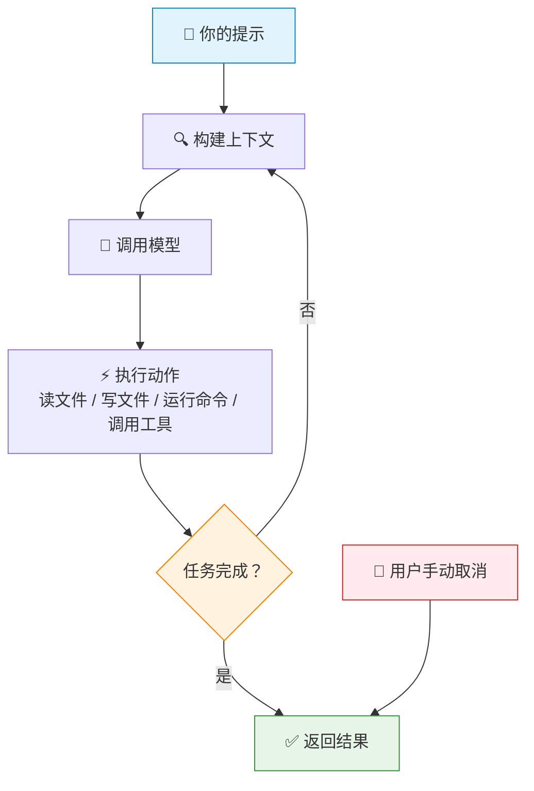

每一步中，模型输出可能包含：读文件、写文件、执行 shell 命令、调用 MCP 工具、搜索代码等。Codex 执行这些动作后，将结果反馈给模型，模型再决定下一步做什么。这个循环一直持续，直到模型判断任务完成或者你手动取消。

**关键理解**：你给的不是"一段代码的补全请求"，而是"一个任务目标"。Codex 自己决定如何分解、探索、实现和验证。

### 1.2 上下文是怎么构建的

在调用模型之前，Codex 需要把所有相关信息塞进模型的上下文窗口。这个上下文由多层信息组装而成：

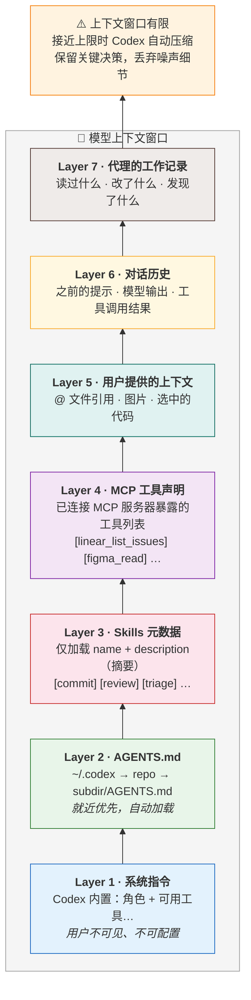

**逐层解释**：

- **Layer 1（系统指令）**：Codex 内置的，告诉模型"你是谁、你有哪些工具、你怎么工作"。用户不可见也不可配置。
- **Layer 2（AGENTS.md）**：你配置的持久化规则，自动加载。这是影响 Codex 行为最直接的方式。
- **Layer 3（Skills 元数据）**：Codex 只加载技能的名称和描述（几十个字），用于判断"这个任务是否匹配某个技能"。**不会**把所有技能的完整内容塞进上下文。
- **Layer 4（MCP 工具）**：已连接的 MCP 服务器暴露的工具列表。模型知道这些工具的存在，但不会预加载工具返回的数据。
- **Layer 5-7**：你给的 + 对话积累的 + 代理自己探索到的。

### 1.3 上下文空间有限怎么办

模型上下文窗口是有限的。随着代理不断工作——读文件、执行命令、查看日志——中间输出会膨胀。Codex 有两种应对机制：

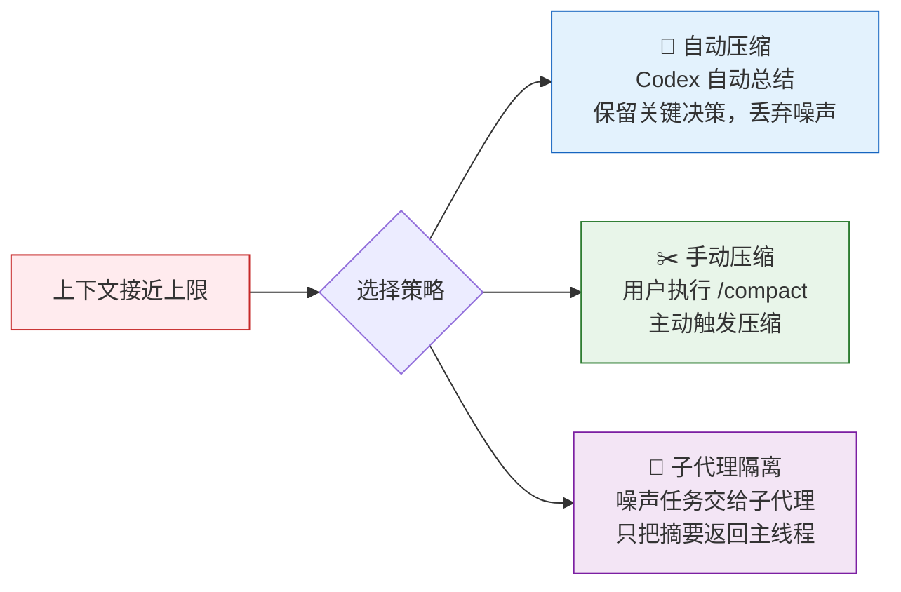

自动压缩可以重复多次，使 Codex 能在多步骤复杂任务上持续工作数小时。

---

## 二、配置系统是怎么工作的

### 2.1 配置的三层覆盖

Codex 的所有行为都可以通过 `config.toml` 配置，配置文件有三层，后者覆盖前者：

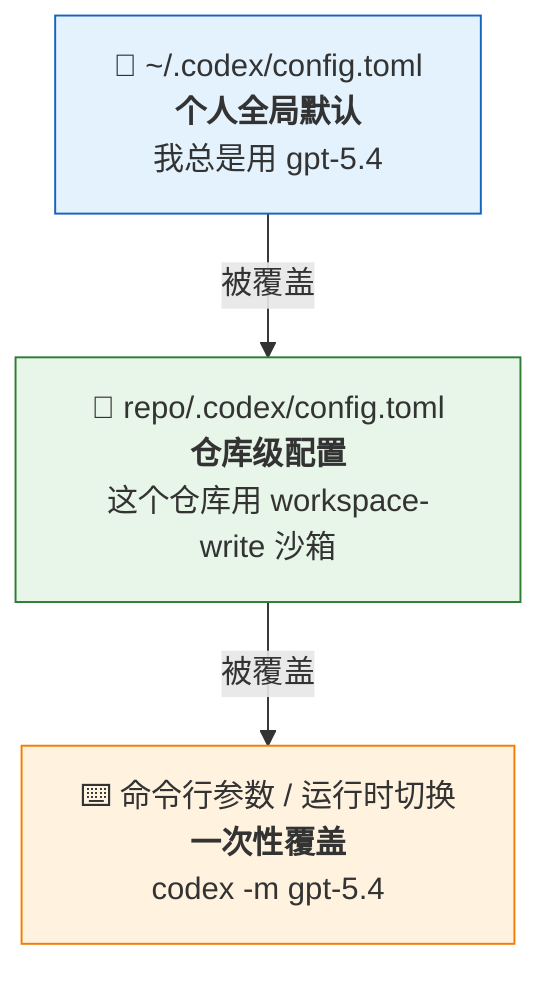

这意味着：你可以有个人偏好（比如"我总是用 gpt-5.4"），也可以让每个仓库有自己的覆盖（比如"这个仓库用 workspace-write 沙箱"），还可以在具体任务时临时切换。

### 2.2 可配置的关键参数

```toml
# 使用哪个模型
model = "gpt-5.4"

# 模型推理深度：low / medium / high / extra-high
# 越高越深思熟虑但越慢越贵
model_reasoning_effort = "medium"

# 沙箱模式：控制 Codex 能碰哪些文件
sandbox_mode = "workspace-write"    # read-only / workspace-write / danger-full-access

# 审批策略：控制 Codex 什么时候必须停下来问你
approval_policy = "on-request"      # untrusted / on-request / never

# 扩展可写目录（不改变沙箱模式，只是多加几个可写路径）
sandbox_workspace_write.writable_roots = ["/path/to/another/dir"]

# MCP 服务器配置
[mcp_servers.linear]
url = "https://mcp.linear.app"

# 子代理配置（在 agents/ 目录下的 yaml 文件中定义）
```

### 2.3 沙箱和审批如何配合工作

这是理解 Codex 安全模型的关键。沙箱和审批是 **两个独立的旋钮**，不是同一个东西：

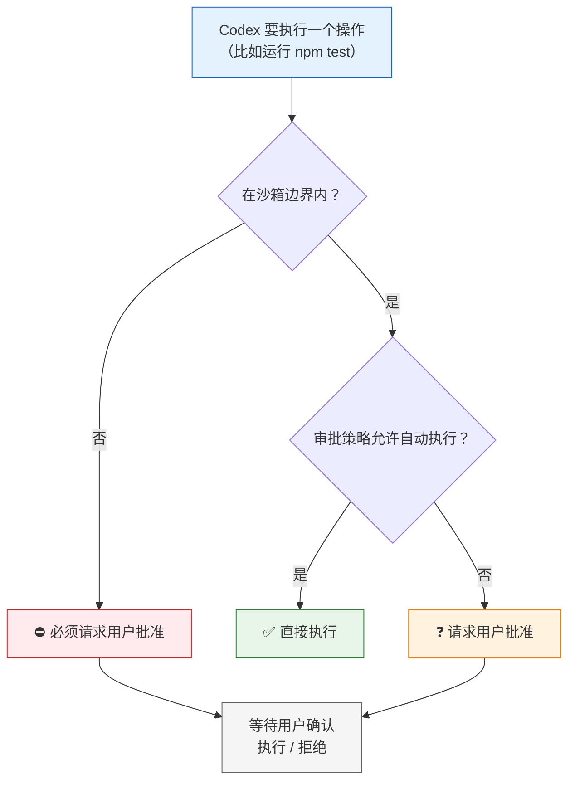

**具体例子**：

| 沙箱模式 | 审批策略 | Codex 想读文件 | Codex 想写文件 | Codex 想执行 npm test |
|---|---|---|---|---|
| read-only | untrusted | 直接读 | 问你 | 问你 |
| workspace-write | on-request | 直接读 | 直接写 | 直接执行 |
| workspace-write | untrusted | 直接读 | 直接写 | 问你 |
| danger-full-access | never | 直接读 | 直接写 | 直接执行 |

**默认推荐**：`workspace-write` + `on-request`。Codex 可以自由读写工作区文件和运行项目命令，但想访问工作区外的文件或执行潜在危险操作时会停下来问你。

**`--full-auto` 的真实含义**：不是"完全不管"，而是 `workspace-write` + `on-request`——仍然有沙箱边界，只是工作区内的操作不需要审批。

**完全不受限** = `danger-full-access` + `never`，移除所有文件系统和网络边界，**慎用**。

---

## 三、AGENTS.md 是怎么生效的

### 3.1 工作原理

AGENTS.md 是一个纯文本文件，在代理循环开始前被读取并注入上下文。它本质上是你写给模型的一段"系统指令"，告诉模型"在这个项目里你应该怎么工作"。

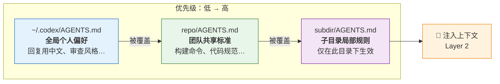

如果你在 `src/auth/` 目录下启动 Codex，它会同时加载三个文件，`src/auth/AGENTS.md` 中的规则优先于仓库根目录的规则。

### 3.2 应该放什么

AGENTS.md 的作用是 **消除重复提示**。如果你发现自己每次都在提示里说同样的话，就应该把它写进 AGENTS.md：

```markdown
# 项目约定

## 构建 & 测试
- 构建：`npm run build`
- 测试：`npm test -- --watch=false`
- Lint：`npm run lint`

## 代码规范
- 使用 TypeScript strict 模式
- 组件使用函数式组件 + hooks
- API 调用统一放在 src/api/ 目录
- 不要修改 src/legacy/ 中的文件

## PR 规范
- 每个 PR 只做一件事
- 必须通过 CI 才能合并
- commit message 用中文
```

### 3.3 不应该放什么

- 一次性任务的描述（这是提示词的事）
- 长篇的架构文档（模型读太多会分散注意力）
- 模糊的"最好""尽量"类规则（无法执行，浪费上下文）

### 3.4 维护方法

AGENTS.md 应该是一个 **反馈循环**：

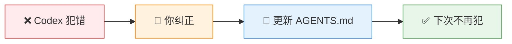

你可以在提示里说"把这个规则加到 AGENTS.md"，或者在 GitHub PR 评论里 `@codex add this to AGENTS.md`。

---

## 四、Skills 是怎么被发现和执行的

### 4.1 技能发现机制

Skills 是 Codex 的"插件系统"。它采用 **渐进式加载（Progressive Disclosure）**——不会一次性把所有技能的全部内容塞进上下文，而是分三步：

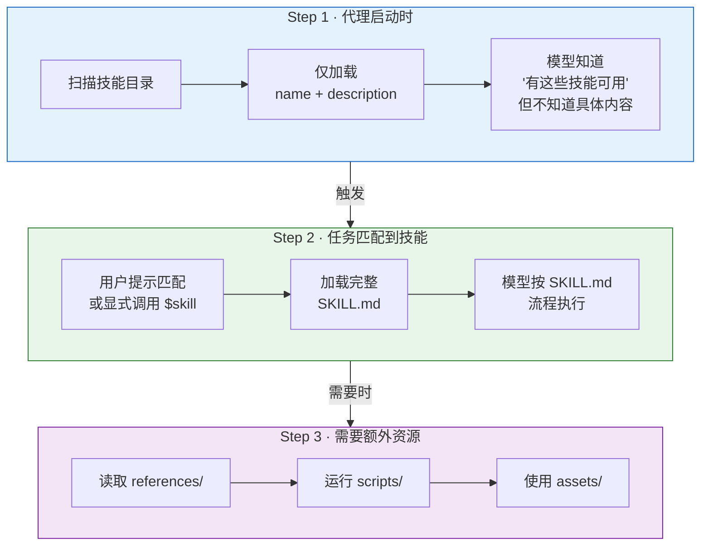

**触发方式**：
- **显式调用**：在提示中输入 `$commit`（`$` 前缀调用技能），或在 CLI/IDE 中运行 `/skills` 浏览可用技能后选择
- **隐式匹配**：用户说"帮我提交代码"，模型根据 description 自动选择 commit 技能（可通过 `agents/openai.yaml` 中的 `allow_implicit_invocation: false` 禁用）

> 注意：`$` 前缀是技能调用机制，`/` 前缀是内置斜杠命令（如 `/review`、`/compact`），两者是不同的系统。

这就是为什么技能的 description 写得好不好非常关键——它决定了模型能不能准确匹配。

### 4.2 技能的结构

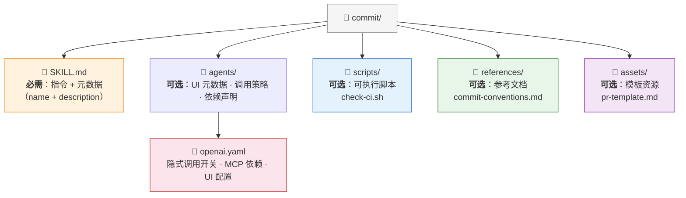

SKILL.md 的格式：

```yaml
---
name: commit
description: Stage and commit changes in semantic groups.
  Use when the user wants to commit, organize commits,
  or clean up a branch before pushing.
---

1. Do not run `git add .`. Stage files in logical groups by purpose.
2. Group into separate commits: feat → test → docs → refactor → chore.
3. Write concise commit messages that match the change scope.
4. Keep each commit focused and reviewable.
```

### 4.3 技能与 MCP 的配合

当一个技能需要访问外部系统时，它会调用 MCP 工具。比如一个"创建 PR"的技能可能需要：

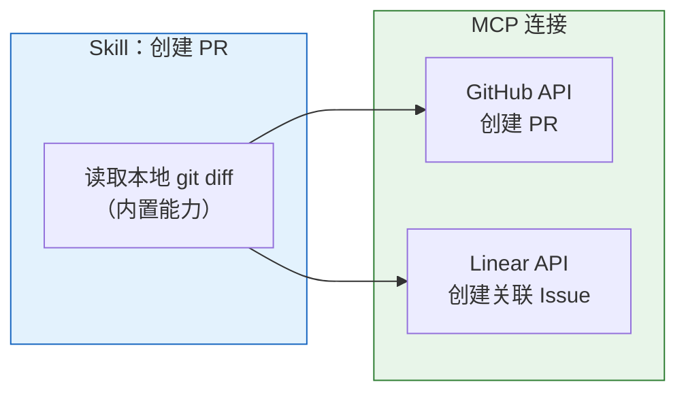

技能定义"做什么"（工作流），MCP 提供"连接外部系统的能力"。

### 4.4 技能的发现、创建与安装

**技能扫描位置**：Codex 按以下顺序从多个位置发现技能，同名技能不会合并：

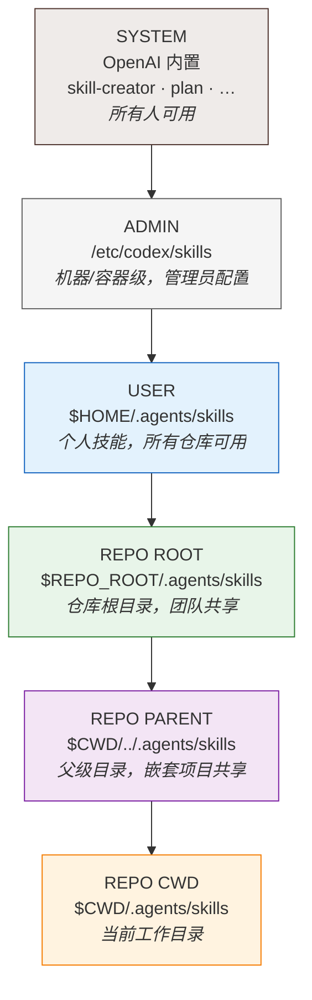

**创建技能**：使用内置的 `$skill-creator` 技能，它会询问技能做什么、何时触发、是否需要脚本。

**安装技能**：使用 `$skill-installer`，例如 `$skill-installer linear` 安装 Linear 技能。

**禁用技能**：在 `~/.codex/config.toml` 中配置，无需删除文件：
```toml
[[skills.config]]
path = "/path/to/skill/SKILL.md"
enabled = false
```

---

## 五、MCP 是怎么工作的

### 5.1 MCP 的角色

MCP（Model Context Protocol）解决的问题是：**Codex 需要的信息或操作不在本地仓库里**。

比如：
- 你想让 Codex 查看 Linear 上的 issue → 需要 Linear MCP
- 你想让 Codex 读取 Figma 设计稿 → 需要 Figma MCP
- 你想让 Codex 查看生产日志 → 需要你的日志系统 MCP

Codex 支持两种 MCP 传输协议：**STDIO**（本地进程）和 **Streamable HTTP**（远程服务，支持 OAuth 认证）。

### 5.2 工作流程

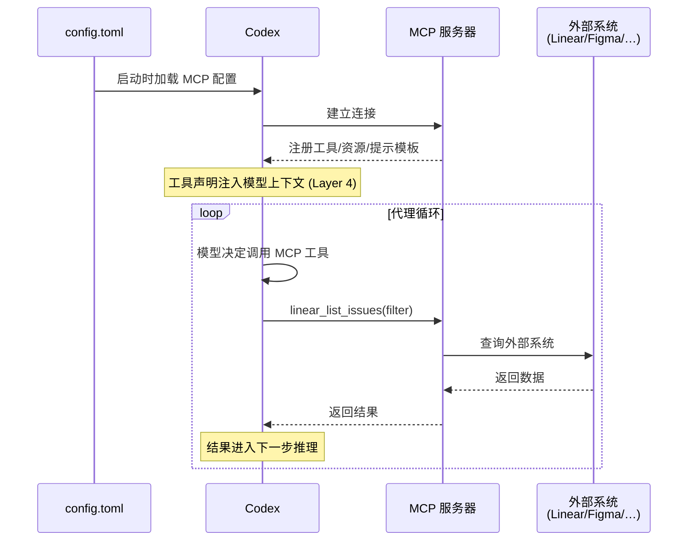

### 5.3 什么该用 MCP，什么不该

| 适合 MCP | 不适合 MCP |
|---|---|
| 数据频繁变化（issue 状态、日志） | 仓库内的静态信息（用 AGENTS.md） |
| 需要远程操作（创建 PR、发消息） | 一次性操作（直接在提示里说明） |
| 多人/多项目共享的集成 | 仅你个人偶尔用的工具 |
| 模型需要实时数据才能做好决策 | 模型不需要这份数据也能工作 |

---

## 六、子代理是怎么工作的

### 6.1 为什么需要子代理

当代理执行复杂任务时，它会产生大量中间输出：文件内容、命令输出、测试日志、堆栈跟踪。这些输出会迅速填满上下文窗口，导致两个问题：

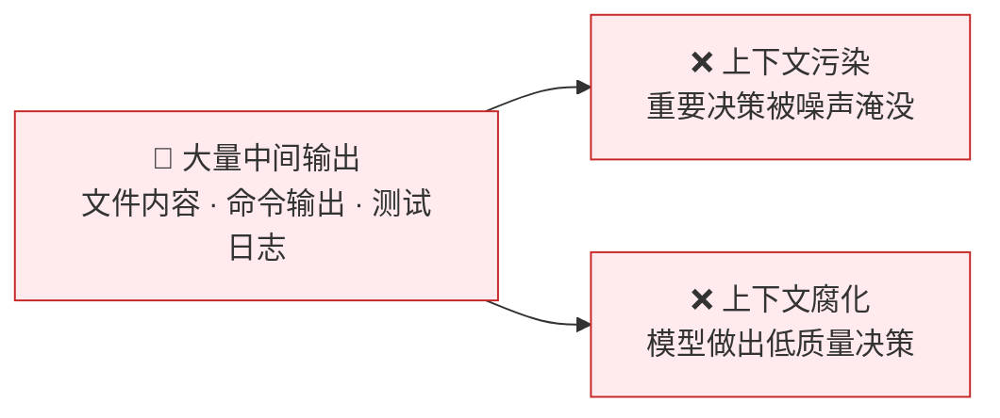

子代理的核心思想：**把噪声工作隔离到独立的上下文中，只把结论返回主线程**。

### 6.2 工作流程

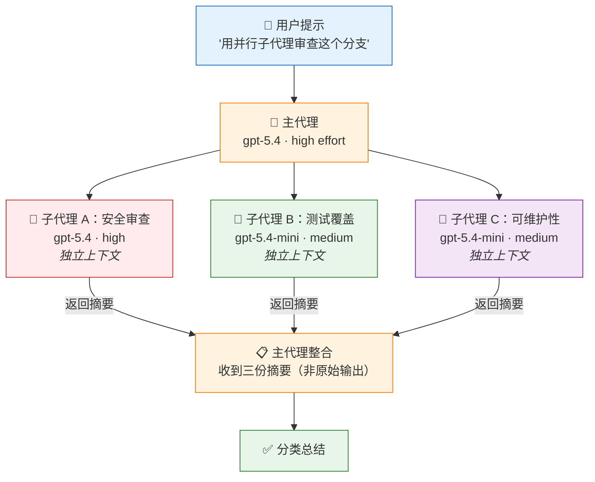

**关键点**：
- 每个子代理有 **独立的上下文窗口**，不会污染主线程
- 子代理返回的是 **摘要**，不是原始中间输出
- 子代理可以并行运行，节省时间
- 子代理可以使用不同的模型和推理级别（简单的用 mini，复杂的用主模型）

### 6.3 什么时候该用 / 不该用

| 适合子代理 | 不适合子代理 |
|---|---|
| 读密集型并行任务（代码探索、测试、分类） | 需要串行决策的任务 |
| 会产生大量噪声输出的任务 | 简单的单文件修改 |
| 可以独立完成的子任务 | 子任务之间有强依赖 |
| 你需要主线程保持清晰 | 任务本身就很简单 |

**读写分离原则**：读密集型任务（探索、分析、审查）放心并行。写密集型任务（修改代码）要谨慎并行，因为多个代理同时改代码会产生冲突。

### 6.4 触发方式

Codex **不会自动派生子代理**。你必须明确要求：

```
"spawn two agents to explore the codebase in parallel"
"delegate this work in parallel"
"use one agent per module"
```

子代理消耗更多 token（每个子代理有自己的模型调用和工具使用），所以只在真正需要时使用。

---

## 七、各组件如何协同——一个完整场景

假设你在一个 Next.js 项目中，想修复一个用户报告的 bug，这个 bug 与 Linear 上的一个 issue 关联。你的项目配置了 AGENTS.md、一个 debug 技能、Linear MCP。

### 场景：修复一个已知的认证 bug

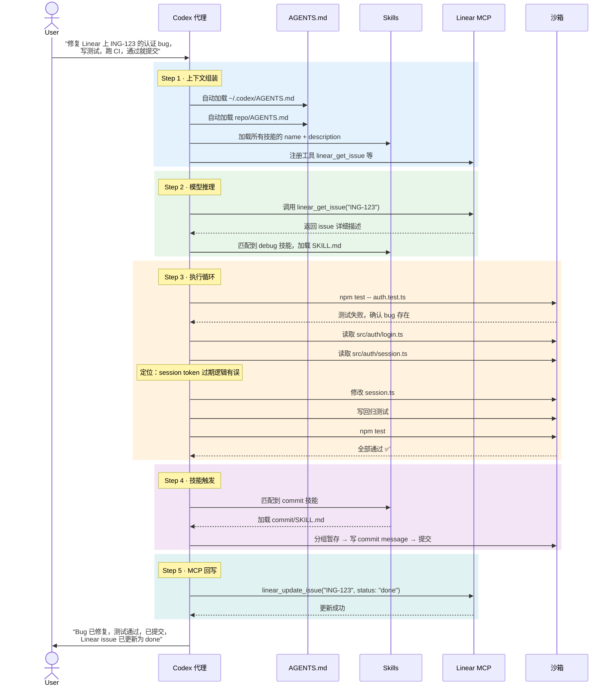

## 八、线程管理

### 8.1 一个线程的生命周期

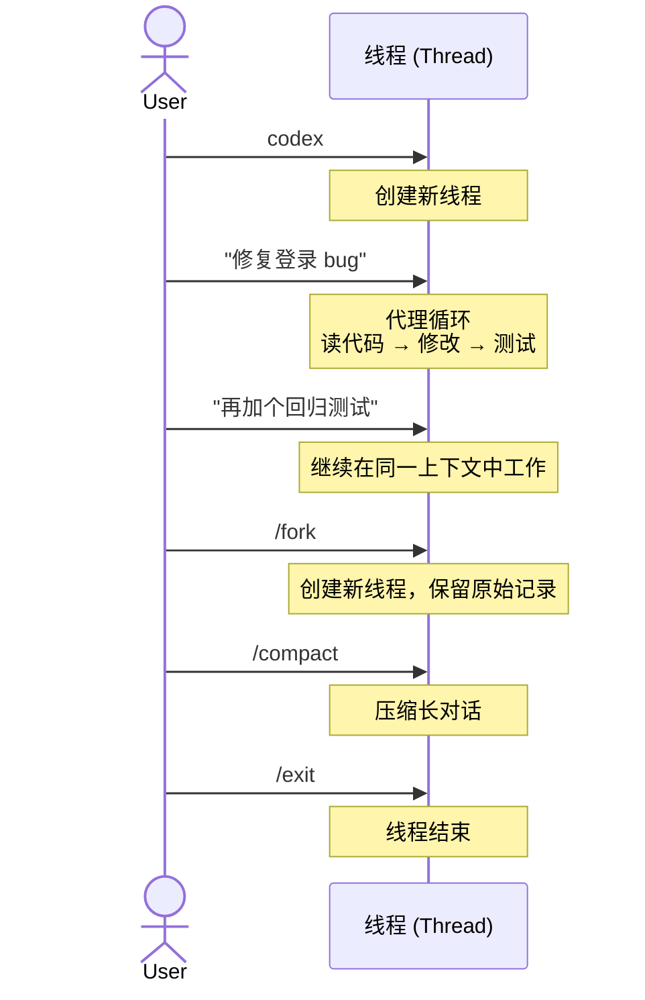

### 8.2 线程管理的原则

- **一个线程 = 一个连贯的工作单元**。只要还在解决同一个问题，就留在同一个线程——上下文中的历史决策和探索结果是有价值的。
- **分叉（fork）** 而非新开。当你想尝试不同方向时，用 `/fork` 保留原始线程。
- **不要一个项目一个线程**。长期线程会因上下文膨胀而质量下降。完成一个任务就结束线程。

### 8.3 本地线程 vs 云线程

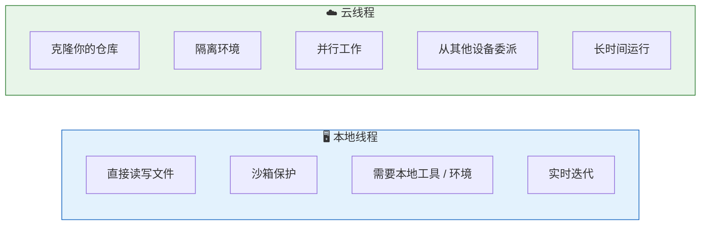

---

## 九、网络安全机制

### 9.1 Codex 为什么会拒绝某些请求

GPT-5.3-Codex（Codex 使用的核心模型之一）被 OpenAI 归类为 **高网络安全能力模型**。这意味着它既擅长帮助你做安全审计，理论上也能被滥用。

OpenAI 的应对措施：

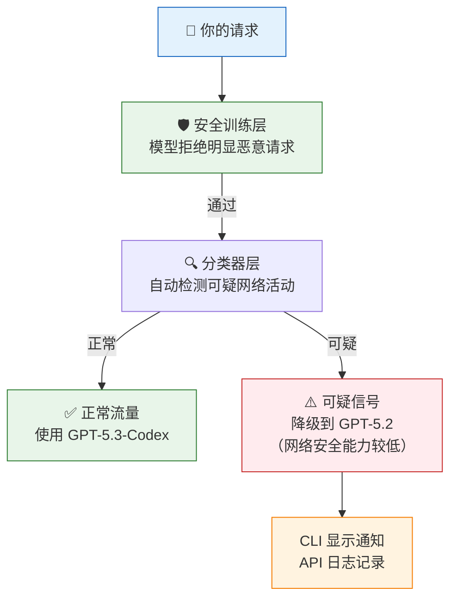

### 9.2 如果你是安全研究人员

如果你的合法工作被误判，有两条路：

1. **信任访问（Trusted Access）**：在 chatgpt.com/cyber 验证身份，恢复使用高能力模型
2. **报告误报**：在 CLI 中使用 `/feedback` 命令

---

## 附录 A：快速上手检查清单

- [ ] 安装 Codex CLI：`codex`
- [ ] 运行 `/init` 生成初始 AGENTS.md，编辑为你的项目实际情况
- [ ] 配置 `~/.codex/config.toml` 设置个人默认模型
- [ ] 确认沙箱模式为 `workspace-write`（默认值）
- [ ] 第一个任务：给 Codex 一个简单明确的 bug 修复
- [ ] 观察它如何读文件、修改、测试
- [ ] 把反复出现的规则写入 AGENTS.md
- [ ] 识别重复性工作流，创建第一个 Skill
- [ ] 如需外部系统，添加第一个 MCP 服务器

## 附录 B：config.toml 配置模板

```toml
# === 模型 ===
model = "gpt-5.4"
model_reasoning_effort = "medium"

# === 安全 ===
sandbox_mode = "workspace-write"
approval_policy = "on-request"
sandbox_workspace_write.writable_roots = []

# === MCP 服务器 ===
# [mcp_servers.my-server]
# url = "https://..."

# === 子代理（在 agents/*.yaml 中定义）===
```

## 附录 C：项目文件结构

```
~/.codex/
├── config.toml              # 个人全局配置（模型、沙箱、审批等）
└── AGENTS.md                # 个人全局代理指导

repo-root/
├── .codex/
│   └── config.toml          # 仓库级配置（团队共享）
├── AGENTS.md                # 仓库级代理指导（团队共享）
├── agents/                  # 子代理定义（YAML 文件）
│   ├── reviewer.yaml
│   └── tester.yaml
├── .agents/
│   └── skills/              # 团队共享技能
│       ├── commit/
│       │   ├── SKILL.md
│       │   └── agents/
│       │       └── openai.yaml   # 可选：UI 元数据、调用策略、依赖
│       └── review/
│           ├── SKILL.md
│           └── scripts/
│               └── run-lint.sh
└── src/
    └── auth/
        └── AGENTS.md        # 子目录级规则（仅在此目录下生效）

$HOME/.agents/skills/        # 个人技能（所有仓库可用）
/etc/codex/skills/           # 管理员级技能（机器/容器级，所有用户共享）
```

---

*文档来源：OpenAI Codex 官方文档 (developers.openai.com/codex)*
*整理时间：2026-03-25*
